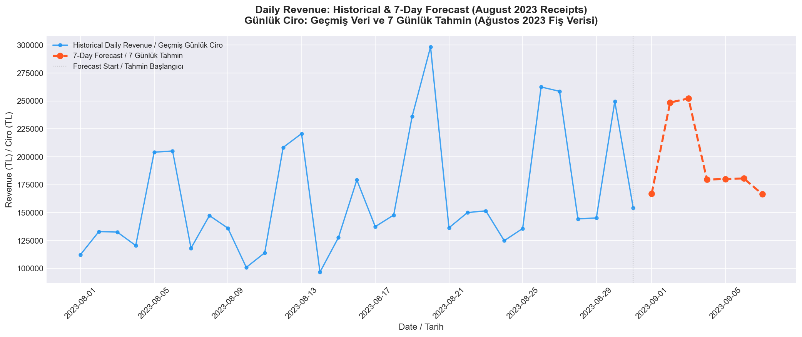

# Retail Database Analytics

## Project Purpose

This project is a full-stack data science platform that covers every stage of the analytics lifecycle. It starts with an ETL pipeline that ingests 540K+ real e-commerce transactions from CSV, cleans the data, and loads it into a MySQL database. It then runs SQL-based business analytics to surface key insights. Finally, it leverages machine learning (RandomForestRegressor) to forecast the next 7 days of daily revenue, complete with automated visualization.

## Proje Amacı

Bu proje, analitik yaşam döngüsünün her aşamasını kapsayan kapsamlı bir veri bilimi platformudur. 540.000+ gerçek e-ticaret işlemini CSV'den alıp temizleyen ve MySQL veritabanına yükleyen bir ETL hattı ile başlar. Ardından SQL tabanlı iş analitiği ile temel içgörüleri ortaya çıkarır. Son olarak, makine öğrenmesi (RandomForestRegressor) kullanarak önümüzdeki 7 günün günlük cirosunu tahmin eder ve otomatik görselleştirme üretir.

---

## Dataset Information

The dataset is the **Online Retail** dataset sourced from [Kaggle](https://www.kaggle.com/). It contains **540,000+** real-world e-commerce transaction records from a UK-based online retailer. The data intentionally includes real-world quality issues such as:

- Missing `CustomerID` values
- Zero or negative `Quantity` entries (returns/cancellations)
- Zero or negative `UnitPrice` values (invalid pricing)

These issues are handled and cleaned by the pipeline before loading into the database.

## Veri Seti Bilgisi

Veri seti, [Kaggle](https://www.kaggle.com/) platformundan alınan **Online Retail** veri setidir. İngiltere merkezli bir online perakendeciye ait **540.000+** gerçek e-ticaret işlem kaydı içerir. Veri, gerçek dünya kalite sorunlarını kasıtlı olarak barındırır:

- Eksik `CustomerID` değerleri
- Sıfır veya negatif `Quantity` kayıtları (iadeler/iptaller)
- Sıfır veya negatif `UnitPrice` değerleri (geçersiz fiyatlandırma)

Bu sorunlar, veritabanına yüklenmeden önce pipeline tarafından temizlenir.

---

## Technologies Used / Kullanılan Teknolojiler

| Technology / Teknoloji | Role / Rolü |
|---|---|
| **Python** | Core programming language / Ana programlama dili |
| **Pandas** | Data reading, cleaning & transformation / Veri okuma, temizleme ve dönüştürme |
| **MySQL** | Relational database storage / İlişkisel veritabanı depolama |
| **SQLAlchemy** | Database connection & SQL query execution / Veritabanı bağlantısı ve SQL sorgu yürütme |
| **PyMySQL** | MySQL driver for SQLAlchemy / SQLAlchemy için MySQL sürücüsü |
| **python-dotenv** | Secure credential management via `.env` / `.env` ile güvenli kimlik bilgisi yönetimi |
| **Scikit-Learn** | Machine learning model training & evaluation / Makine öğrenmesi model eğitimi ve değerlendirme |
| **Matplotlib** | Data visualization & forecast plotting / Veri görselleştirme ve tahmin grafikleri |
| **NumPy** | Numerical computing & array operations / Sayısal hesaplama ve dizi işlemleri |

---

## How to Run / Nasıl Çalıştırılır

### 1. Download the dataset / Veri setini indir

Download the **Online Retail** dataset from [Kaggle](https://www.kaggle.com/datasets/vijayuv/onlineretail) and place the `data.csv` file in the project root directory.

**Online Retail** veri setini [Kaggle](https://www.kaggle.com/datasets/vijayuv/onlineretail) adresinden indirip `data.csv` dosyasını proje ana dizinine yerleştirin.

### 2. Install dependencies / Bağımlılıkları kur

```bash
pip install -r requirements.txt
```

### 3. Configure credentials / Kimlik bilgilerini yapılandır

Copy the example file and fill in your MySQL credentials:

`.env.example` dosyasını kopyalayıp MySQL bilgilerinizi girin:

```bash
cp .env.example .env
```

Then edit `.env` / Ardından `.env` dosyasını düzenleyin:

```
MYSQL_HOST=localhost
MYSQL_PORT=3306
MYSQL_USER=your_username
MYSQL_PASSWORD=your_password
MYSQL_DATABASE=your_database
```

### 4. Run the pipeline / Pipeline'ı çalıştır

```bash
python database_builder.py
```

### 5. Run the ML forecaster / ML tahmin modelini çalıştır

```bash
python ml_forecaster.py
```

---

## Output / Çıktı

The script prints the following analytics to the terminal after loading the data:

Script, veriyi yükledikten sonra aşağıdaki analizleri terminale yazdırır:

- **Top 5 Countries by Revenue** / Ciroya göre ilk 5 ülke
- **Top 5 Products by Quantity Sold** / Satış adedine göre ilk 5 ürün

### Terminal Screenshot / Terminal Ekran Görüntüsü


---

## Phase 2: AI & Time Series Forecasting

This phase uses the cleaned sales data stored in MySQL to train a **RandomForestRegressor** model (scikit-learn) that predicts the next **7 days** of daily revenue. The system extracts data via SQLAlchemy, engineers time-series features, trains the model, evaluates its performance (MAE & R²), and generates a visual forecast chart.

**Feature Engineering:** The pipeline aggregates transaction-level data into daily revenue totals, then creates the following features for the model:
- `Day_of_Week` — Captures weekly seasonality patterns
- `Month` — Captures monthly trends
- `Rolling_Mean_7d` — 7-day moving average to smooth short-term fluctuations
- `Day_Index` — Numeric trend indicator

## Aşama 2: Yapay Zeka ve Gelecek Tahmini

Bu aşamada, MySQL'de saklanan temizlenmiş satış verisi kullanılarak **RandomForestRegressor** modeli (scikit-learn) eğitilir ve önümüzdeki **7 günün** günlük cirosu tahmin edilir. Sistem SQLAlchemy ile veriyi çeker, zaman serisi özellikleri üretir, modeli eğitir, performansını değerlendirir (MAE & R²) ve görsel bir tahmin grafiği oluşturur.

**Özellik Mühendisliği:** Pipeline, işlem bazlı veriyi günlük ciro toplamlarına dönüştürür, ardından model için şu özellikleri oluşturur:
- `Day_of_Week` — Haftalık mevsimsellik kalıplarını yakalar
- `Month` — Aylık trendleri yakalar
- `Rolling_Mean_7d` — Kısa vadeli dalgalanmaları düzleştiren 7 günlük hareketli ortalama
- `Day_Index` — Sayısal trend göstergesi

### Forecast Output / Tahmin Çıktısı




